# analisis
1. 2.a menggunakan tag script
```html
<HTML>
<HEAD><TITLE> contoh JavaScript</TITLE>
<script language="JavaScript">
document.write("Program JavaSript Aku di kepala");
</script>
</HEAD>
<BODY>
<script language="JavaScript">
document.write("Program JavaSript Aku di body");
</script>
</BODY>
</HTML>
```
Kode tersebut menempatkan JavaScript pada bagian head dan body di mana perintah document.write("Program JavaScript Aku di kepala"); pada head akan menuliskan teks "Program JavaScript Aku di kepala" sedangkan perintah document.write("Program JavaScript Aku di body"); pada body akan menampilkan teks "Program JavaScript Aku di body", sehingga saat dijalankan di browser halaman akan menampilkan kedua tulisan tersebut secara berurutan dan sekaligus membuktikan bahwa JavaScript dapat diletakkan serta dijalankan baik di dalam bagian head maupun body pada dokumen HTML.

2. 2.b menggunakan file eskternal
```html
    <SCRIPT LANGUAGE= Javascript SRC= url/file.js > </SCRIPT>
```
Kode SCRIPT LANGUAGE="JavaScript" SRC="url/file.js"> /SCRIPT berfungsi untuk memanggil dan menjalankan file JavaScript eksternal dari alamat atau direktori yang ditentukan pada atribut SRC, sehingga memungkinkan pemisahan kode JavaScript dari file HTML agar lebih rapi, mudah dikelola, serta dapat digunakan ulang di berbagai halaman web.

3. 2.c event tertentu
```html
<!DOCTYPE html>
<html>
<head>
<title>Belajar Javascript : Mengenal Event Pada Javascript</title>
</head>
<body>
<h1>Mengenal Event Pada Javascript</h1>
<h2> Perograman WEB Event one click</h2>
<!-- memberikan event pada element tombol -->
<button onclick="tampilkan_nama()">klik disini </button>
<!-- id hasil -->
<div id="hasil"></div>
<script>
// membuat function tampilkan_nama
function tampilkan_nama(){
document.getElementById("hasil").innerHTML =
"<h3>Nama Saya adalah Nur Karmila Agustina</h3>";
}
</script>
</body>
</html>
```
Kode HTML ini mendefinisikan sebuah halaman berjudul "Belajar Javascript : Mengenal Event Pada Javascript" yang menampilkan judul utama dan subjudul, kemudian menyediakan sebuah tombol dengan event onclick yang ketika ditekan akan memanggil fungsi tampilkan_nama(), di mana fungsi tersebut melalui perintah document.getElementById("hasil").innerHTML akan mencari elemen div dengan id="hasil" yang awalnya kosong lalu mengganti isinya menjadi teks "Nama Saya adalah Nur Karmila Agustina" dengan format heading h3, sehingga kode ini sekaligus memperlihatkan bagaimana JavaScript dapat diletakkan langsung di dalam dokumen HTML untuk menangani event pengguna (user event) dan memanipulasi isi elemen HTML secara dinamis pada saat interaksi terjadi.

4. 2.d contoh sederhana
```html
<HTML>
<HEAD><TITLE> contoh sederhana JavaScript</TITLE></HEAD>
</BODY>
<script language="JavaScript">
document.write("Selamat Belajar Angkatan 2025","<br>");
document.write("JavaScript Pemrograman WEB Teknik Komputer");
</script>
</BODY>
</HTML>
```
pada HTML ini membuat sebuah halaman dengan judul "contoh sederhana JavaScript" yang di dalam bagian body-nya menyisipkan script JavaScript menggunakan perintah document.write(), di mana baris pertama menuliskan teks "Selamat Belajar Angkatan 2025" kemudian disertai tag br untuk pindah baris, sedangkan baris kedua menampilkan teks "JavaScript Pemrograman WEB Teknik Komputer", sehingga keseluruhan program sederhana ini menunjukkan bagaimana JavaScript dapat digunakan secara langsung di dalam dokumen HTML untuk menghasilkan output berupa teks yang tampil di halaman web.

5. 3 memasukkan data
```html
<HTML>
<HEAD>
<TITLE>Masukan Data</TITLE>
</HEAD>
<BODY>
<SCRIPT LANGUAGE = "JavaScript">
<!--
var nama = prompt("Siapa nama Anda?");
document.write("Hai, " + nama);
//-->
</SCRIPT>
</BODY>
</HTML>
```
pada HTML ini membuat halaman berjudul "Masukan Data" yang di dalam body terdapat script JavaScript dengan perintah prompt("Siapa nama Anda?") untuk meminta input nama dari pengguna, lalu menyimpan hasilnya ke variabel nama dan menampilkannya kembali ke halaman dengan document.write("Hai, " + nama), sehingga program sederhana ini menunjukkan bagaimana JavaScript dapat digunakan untuk menerima masukan dari pengguna melalui prompt dan langsung menampilkannya di halaman web.

6. 4 jendela peringatan dan konfirmasi contoh 1
```html
<HTML>
  <HEAD>
    <TITLE>Alert Box</TITLE>
  </HEAD>
  <BODY>
    <SCRIPT LANGUAGE = JavaScript >
      <!--
      window.alert("apakah anda ingin meninggalkan laman ini"); 
      //-->
    </SCRIPT>
  </BODY>
</HTML>
```
pada kode HTML ini membuat halaman berjudul "Alert Box" yang di dalam body terdapat script JavaScript menggunakan perintah window.alert("apakah anda ingin meninggalkan laman ini"); untuk menampilkan kotak dialog peringatan (alert box) berisi pesan "apakah anda ingin meninggalkan laman ini" ketika halaman dibuka, sehingga program ini memperlihatkan cara penggunaan fungsi alert() dalam JavaScript untuk memberikan notifikasi atau informasi langsung kepada pengguna melalui jendela pop-up di browser.

7. 4 jendela peringatan dan konfirmasi contoh 2
```html
<HTML>
<HEAD>
<TITLE>Konfirmasi</TITLE>
</HEAD>
<BODY>
<SCRIPT LANGUAGE = "JavaScript">
<!--
var jawaban = window.confirm(
"Apakah anda sudah yakin ?");
document.write("Jawaban Anda: " + jawaban);
//-->
</SCRIPT>
</BODY>
</HTML>
```
pada kode ini membuat halaman berjudul "Konfirmasi" yang di dalam body menyisipkan script JavaScript dengan perintah window.confirm("Apakah anda sudah yakin ?") untuk menampilkan kotak dialog konfirmasi berisi pilihan OK atau Cancel, menyimpan hasil pilihan pengguna berupa nilai true jika menekan OK atau false jika menekan Cancel ke dalam variabel jawaban, lalu menampilkannya di halaman menggunakan document.write("Jawaban Anda: " + jawaban), sehingga program ini menunjukkan cara penggunaan fungsi confirm() dalam JavaScript untuk meminta persetujuan atau keputusan dari pengguna secara interaktif.

8. 5.a mendeklarasikan variabel
```html
<script language="Javascript">
<!--
var VariabelKu;
var VariabelKu2 = 3;
VariabelKu = 1234;
document.write(VariabelKu*VariabelKu2);
// -->
</script>
```
pada Kode JavaScript ini mendeklarasikan variabel VariabelKu tanpa nilai awal lalu memberikan nilai 1234, mendeklarasikan variabel VariabelKu2 dengan nilai 3, kemudian menghitung hasil perkalian VariabelKu * VariabelKu2 yaitu 1234 * 3 = 3702 dan menampilkannya ke halaman menggunakan document.write(), sehingga program ini menunjukkan cara mendefinisikan variabel, memberi nilai, melakukan operasi aritmatika, dan menampilkan hasil perhitungan dengan JavaScript.

8. 5.b global
```html
<SCRIPT language="Javascript">
<!--
var a = 12;
var b = 4;
function Perkalian_Dengan2(b) {
    a = b * 2;
    return a;
}
document.write("Dua kali dari " + b + " adalah " + Perkalian_Dengan2(b));
document.write("Nilai dari a adalah " + a);
// -->
</SCRIPT>
```
Kode JavaScript ini mendeklarasikan variabel a dengan nilai 12 dan b dengan nilai 4, kemudian membuat fungsi Perkalian_Dengan2(b) yang menghitung hasil perkalian parameter b dengan 2 sekaligus menyimpan hasilnya ke dalam variabel a, lalu menampilkan teks "Dua kali dari 4 adalah 8" dengan memanggil fungsi tersebut serta menampilkan "Nilai dari a adalah 8", sehingga program ini memperlihatkan bagaimana fungsi digunakan untuk melakukan operasi perhitungan, mengubah nilai variabel, dan menampilkan hasilnya ke halaman web.

8. 5.b lokal
```html
<SCRIPT language="Javascript">
<!--
var a = 12;
var b = 4;
function PerkalianDengan2(b) {
    var a = b * 2;
    return a;
}
document.write("Dua kali dari " + b + " adalah ", PerkalianDengan2(b));
document.write("Nilai dari a adalah", a);
// -->
</SCRIPT>
```
pada kode JavaScript ini mendefinisikan variabel global a dengan nilai 12 dan b dengan nilai 4, lalu membuat fungsi PerkalianDengan2(b) yang memiliki variabel lokal a untuk menyimpan hasil perkalian parameter b * 2 dan mengembalikannya sebagai nilai fungsi, kemudian menampilkan teks "Dua kali dari 4 adalah 8" dengan memanggil fungsi tersebut serta menampilkan "Nilai dari a adalah 12" karena variabel a di dalam fungsi bersifat lokal dan tidak mengubah nilai a global, sehingga program ini memperlihatkan perbedaan antara variabel lokal dan variabel global dalam JavaScript sekaligus penggunaannya untuk operasi perhitungan.

9. 7 konversi tipe data
```html
<HTML>
<HEAD>
<TITLE>Konversi Bilangan</TITLE>
</HEAD>
<BODY>
<SCRIPT LANGUAGE = "JavaScript">
<!--
var a = parseInt("27");
document.write("1. " + a + "<BR>");
a = parseInt("27.5");
document.write("2. " + a + "<BR>");
var a = parseInt("27A7");
document.write("3. " + a + "<BR>");
a = parseInt("A27.5");
document.write("4. " + a + "<BR>");
var b = parseFloat("27");
document.write("5. " + b + "<BR>");
b = parseFloat("27.5");
document.write("6. " + b + "<BR>");
var b = parseFloat("27A7");
document.write("7. " + b + "<BR>");
b = parseFloat("A27.5");
document.write("8. " + b + "<BR>")
// -->
</SCRIPT>
</BODY>
</HTML>
```
pada kode ini menampilkan halaman berjudul "Konversi Bilangan" yang di dalam body menyisipkan script JavaScript untuk mendemonstrasikan penggunaan fungsi parseInt() dan parseFloat(), di mana parseInt("27") menghasilkan 27 sebagai bilangan bulat, parseInt("27.5") menghasilkan 27 karena hanya mengambil bagian integer, parseInt("27A7") menghasilkan 27 karena berhenti membaca angka saat menemukan huruf, dan parseInt("A27.5") menghasilkan NaN karena string diawali huruf, sedangkan parseFloat("27") menghasilkan 27, parseFloat("27.5") menghasilkan 27.5, parseFloat("27A7") menghasilkan 27 karena berhenti saat menemukan huruf, dan parseFloat("A27.5") menghasilkan NaN, sehingga keseluruhan program ini menunjukkan bagaimana kedua fungsi tersebut bekerja dalam mengonversi string menjadi angka baik bilangan bulat maupun pecahan di JavaScript.

10. 8 operator aritmatika
```html
<HTML>
<HEAD>
<TITLE>Operasi Matematika</TITLE>
</HEAD>
<BODY>

<SCRIPT LANGUAGE = "JavaScript">
<!--
document.write("2 + 3 = " + (2 + 3));
document.write("<BR>");
document.write("20 - 3 = " + (20 - 3));
document.write("<BR>");
document.write("20 * 3 = " + (20 * 3));
document.write("<BR>");
document.write("40 / 3 = " + (40 / 3));
document.write("<BR>");
// -->
</SCRIPT>

</BODY>
</HTML>
```
pada kode diatas ini membuat halaman berjudul "Operasi Matematika" yang di dalam body menyisipkan script JavaScript untuk menampilkan hasil perhitungan aritmatika sederhana menggunakan document.write(), yaitu operasi penjumlahan 2 + 3 = 5, pengurangan 20 - 3 = 17, perkalian 20 * 3 = 60, dan pembagian 40 / 3 = 13.333..., sehingga program ini memperlihatkan bagaimana JavaScript dapat digunakan langsung di dalam HTML untuk melakukan operasi matematika dasar dan menampilkan hasilnya ke halaman web.

11. 9 operator logika dan pembanding
```html
<HTML>
<HEAD>
<TITLE>Operator ?</TITLE>
</HEAD>
<BODY>
<SCRIPT LANGUAGE = "JavaScript">
<!--
var nilai = prompt("Nilai (0-100): ", 0);
var hasil = (nilai >= 60) ? "Lulus" : "Tidak Lulus";
document.write("Hasil: " + hasil);
// -->
</SCRIPT>
</BODY>
</HTML>
```
Kode ini membuat halaman berjudul "Operator ?" yang di dalam body menyisipkan script JavaScript untuk meminta input angka melalui prompt("Nilai (0-100): ", 0), lalu menyimpan hasilnya ke variabel nilai dan menggunakan operator ternary (nilai >= 60) ? "Lulus" : "Tidak Lulus" untuk menentukan apakah nilai tersebut menghasilkan teks "Lulus" jika lebih besar atau sama dengan 60 atau "Tidak Lulus" jika kurang dari 60, kemudian menampilkannya ke halaman dengan document.write("Hasil: " + hasil), sehingga program ini memperlihatkan cara penggunaan operator ternary dalam JavaScript untuk membuat logika pengkondisian sederhana secara singkat.

# Output
1. 2.a menggunakan tag script
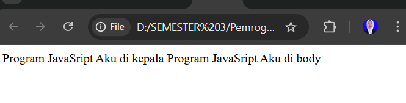

2. 2.c event tertentu
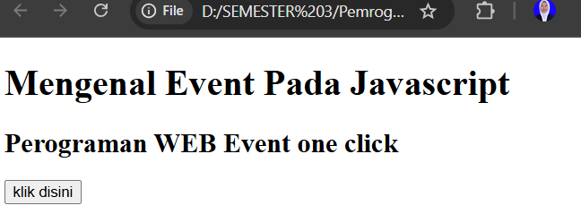

3. 2.d contoh sederhana


4.3 memasukkan data
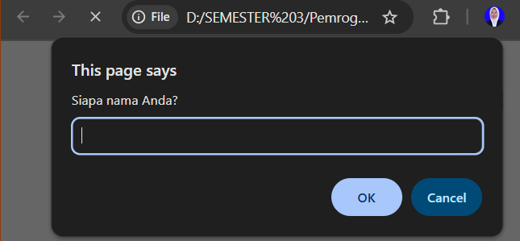

5. 4 jendela peringatan dan konfimasi contoh 1
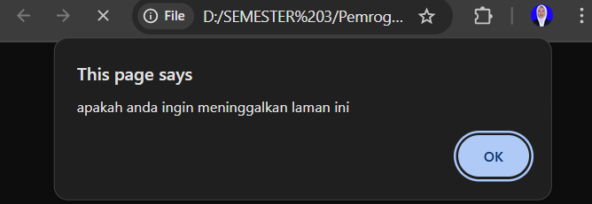

6. 4 jendela peringatan dan konfimasi contoh 2
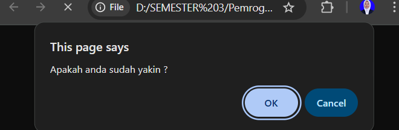

7. 5.a mendeklarasikan variabel
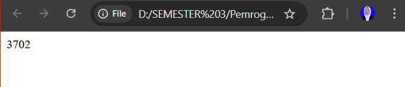

8. 5.b global


9. 5.b local 


10. 7 konversi tipe data
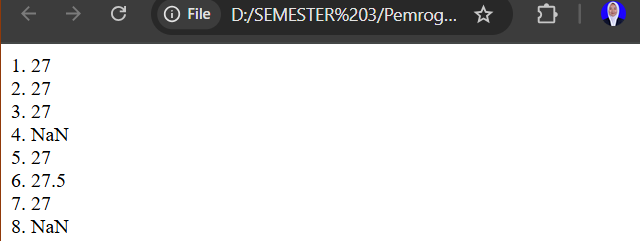

11. 8 operator aritmatika
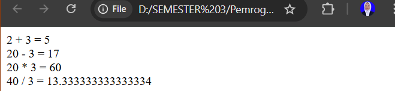

12. 9 operator logika dan pembanding
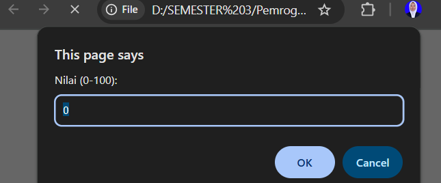


# analisis soal tantangan
1. tugas no 1
```html
<HTML>
<HEAD>
<TITLE>Konversi Bilangan</TITLE>
</HEAD>
<BODY>
<SCRIPT LANGUAGE = "JavaScript">
<!--

   var a = parseInt("100");
   document.write("1. " + a + "<BR>");
   a = parseInt("45.9");
   document.write("2. " + a + "<BR>");
   a = parseInt("123B");
   document.write("3. " + a + "<BR>");
   a = parseInt("B456");
   document.write("4. " + a + "<BR>");

   var b = parseFloat("99");
   document.write("5. " + b + "<BR>");
   b = parseFloat("88.75");
   document.write("6. " + b + "<BR>");
   b = parseFloat("55X");
   document.write("7. " + b + "<BR>");
   b = parseFloat("X77.5");
   document.write("8. " + b + "<BR>");
//-->
</SCRIPT>
</BODY>
</HTML>
```
Kode HTML ini membuat halaman berjudul "Konversi Bilangan" yang di dalam body menyisipkan script JavaScript untuk mendemonstrasikan penggunaan fungsi parseInt dan parseFloat , di mana parseInt "100"menghasilkan 100, parseInt"45.9" menghasilkan 45 karena hanya mengambil bagian bilangan bulat, parseInt("123B") menghasilkan 123 karena berhenti membaca saat menemukan huruf, sedangkan parseInt("B456") menghasilkan NaN karena diawali huruf, lalu parseFloat("99") menghasilkan 99, parseFloat("88.75") menghasilkan 88.75, parseFloat("55X") menghasilkan 55 karena berhenti saat menemukan huruf, dan parseFloat("X77.5") menghasilkan NaN karena string diawali huruf, sehingga program ini menunjukkan secara lengkap bagaimana fungsi parseInt() mengonversi string menjadi bilangan bulat dan fungsi parseFloat() mengonversi string menjadi bilangan pecahan dalam JavaScript.

2. tugas no 2
```html
<HTML>
<HEAD>
<TITLE>Array</TITLE>
</HEAD>
<BODY>
<SCRIPT LANGUAGE = "JavaScript">
<!--
   var buah = new Array("Anggur", "Pisang", "Mangga", "Kelengkeng");
   document.write("Isi array buah:<BR>");
   document.write("1. " + buah[0] + "<BR>");
   document.write("2. " + buah[1] + "<BR>");
   document.write("3. " + buah[2] + "<BR>");
   document.write("4. " + buah[3] + "<BR>");
//-->
</SCRIPT>
</BODY>
</HTML>
```
pada kode HTML ini membuat halaman berjudul "Array" yang di dalam body menyisipkan script JavaScript untuk mendeklarasikan sebuah array bernama buah berisi elemen "Anggur", "Pisang", "Mangga", dan "Kelengkeng", lalu menggunakan document.write untuk menampilkan teks "Isi array buah:" diikuti isi array tersebut berdasarkan indeksnya yaitu buah0 menghasilkan Anggur, buah 1menghasilkan Pisang, buah 2 menghasilkan Mangga, dan buah3 menghasilkan Kelengkeng, sehingga program ini memperlihatkan cara mendefinisikan array, mengakses elemen array dengan indeks, dan menampilkannya ke halaman web menggunakan JavaScript.

3. tugas no 3
```html
<HTML>
<HEAD>
<TITLE>Kalkulator Sederhana </TITLE>
</HEAD>
<BODY>
<H2>Kalkulator Sederhana</H2>

<!-- Input angka -->
Angka Pertama : <input type="text" id="a"><br><br>
Angka Kedua : <input type="text" id="b"><br><br>

<!-- Tombol operasi -->
<button onclick="hitung('+')">Tambah</button>
<button onclick="hitung('-')">Kurang</button>
<button onclick="hitung('*')">Kali</button>
<button onclick="hitung('/')">Bagi</button>
<br><br>

Hasil : <input type="text" id="hasil">

<script language="JavaScript">
<!--
function hitung(op) {
   let x = parseFloat(document.getElementById("a").value);
   let y = parseFloat(document.getElementById("b").value);
   let z = 0;

   if (op == "+") {
      z = x + y;
   } else if (op == "-") {
      z = x - y;
   } else if (op == "*") {
      z = x * y;
   } else if (op == "/") {
      if (y == 0) {
         z = "Error: ÷0";
      } else {
         z = x / y;
      }
   }

   document.getElementById("hasil").value = z;
}
//-->
</script>
</BODY>
</HTML>
```
membuat halaman berjudul "Kalkulator Sederhana" yang menampilkan dua kotak input untuk memasukkan angka pertama id="a" dan angka kedua id="b", lalu menyediakan empat tombol operasi Tambah, Kurang, Kali, Bagi yang masing-masing memanggil fungsi hitung op dengan parameter operator sesuai tombol yang ditekan, di mana fungsi hitung op akan mengambil nilai dari kedua input menggunakan document.getElementById().value, mengubahnya menjadi angka dengan parseFloat, kemudian melakukan perhitungan sesuai operator (+, -, *, /), dengan pengecekan khusus jika pembagian menggunakan nol agar menampilkan pesan "Error: ÷0", dan akhirnya hasil perhitungan ditampilkan ke kotak input id="hasil", sehingga program ini memperlihatkan cara membuat aplikasi kalkulator sederhana berbasis JavaScript dengan input pengguna, percabangan kondisi, dan manipulasi elemen HTML.

4. tugas 4
```html
<HTML>
<HEAD>
<TITLE>Hitung Bangun Ruang</TITLE>
</HEAD>
<BODY>
<SCRIPT LANGUAGE="JavaScript">
<!--
   var sisi = prompt("Masukkan panjang sisi kubus:");
   var volumeKubus = sisi * sisi * sisi;
   document.write("1. Volume Kubus dengan sisi " + sisi + " = " + volumeKubus + "<BR>");

   var p = prompt("Masukkan panjang balok:");
   var l = prompt("Masukkan lebar balok:");
   var t = prompt("Masukkan tinggi balok:");
   var volumeBalok = p * l * t;
   document.write("2. Volume Balok = " + volumeBalok + "<BR>");

   var r = prompt("Masukkan jari-jari tabung:");
   var tinggi = prompt("Masukkan tinggi tabung:");
   var volumeTabung = 3.14 * r * r * tinggi;
   document.write("3. Volume Tabung = " + volumeTabung + "<BR>");
//-->
</SCRIPT>
</BODY>
</HTML>
```
Hitung Bangun Ruang yang di dalam body menyisipkan script JavaScript untuk menghitung volume beberapa bangun ruang dengan meminta input dari pengguna melalui prompt, di mana pertama pengguna diminta memasukkan panjang sisi kubus lalu dihitung volumenya dengan rumus sisi  sisi sisi dan hasilnya ditampilkan dengan teks "Volume Kubus dengan sisi ...", kemudian diminta memasukkan panjang, lebar, dan tinggi balok untuk menghitung volumenya dengan rumus p l t yang ditampilkan sebagai Volume Balok ...", selanjutnya diminta memasukkan jari-jari dan tinggi tabung untuk menghitung volumenya dengan rumus 3.14 * r * r  tinggi yang ditampilkan sebagai Volume Tabung ...", sehingga program ini memperlihatkan penggunaan prompt untuk input interaktif, perhitungan rumus matematika bangun ruang, dan document.write untuk menampilkan hasil perhitungan di halaman web.

# output
1. tugas no 1
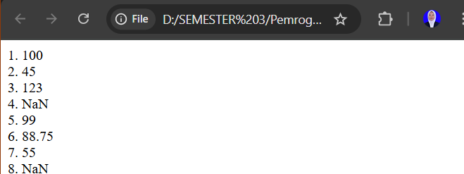

2. tugas no 2
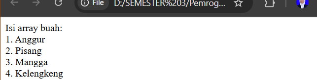

3. tugas no 3
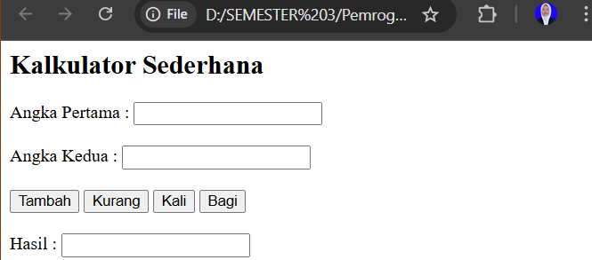

4. tugas no 4
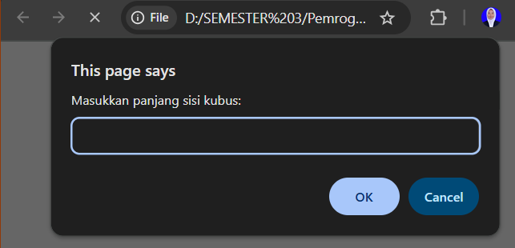


